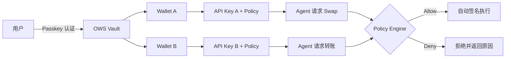

# Gradience Wallet

## Agent Wallet Orchestration Platform

Passkey Identity · OWS Multi-Chain Vault · Policy-Gated Agent Access via MCP

  Open Source · Local-First · MCP-Native

---
layout: default
---

# 一句话定义

Gradience 是一个面向个人与团队的 Agent 钱包编排平台 —— 用 Passkey 接管身份、用 OWS 标准托管本地多链资产、用可编程策略引擎精确控制 AI Agent 的每一笔交易与支付。

  

    
🗝️ Passkey

    
无助助词现代身份认证 + 设备恢复

  

  

    
🔐 OWS

    
本地优先多链钱包（BIP-39 + HD 派生）

  

  

    
🛡️ Policy

    
签名前自动评估：限额 / 合约 / 时间 / 风险信号

  

---
layout: default
---

# 核心机制：Agent 怎么用钱包？

<strong>关键：</strong>Agent 不持有私钥。每一笔操作都必须先通过 Policy Engine 的 pre-signing 评估，才能触发 OWS 本地签名。

---
layout: default
---

# 竞争壁垒：Gradience vs 现有方案

| 维度 | Tempo / 托管钱包 | Gradience Wallet |
|:---|:---|:---|
| **钱包标准** | 私有单生态 | **OWS 开放标准**（BIP-39，本地 vault，多链 HD） |
| **Agent 权限** | 基础 spending limit | **多层 Policy Engine**：限额 + 合约/操作/时间/模型白名单 + 意图风险 + 动态信号 |
| **交互协议** | 私有协议 | **MCP (Model Context Protocol)** — Claude / Cursor 等任意 Host 标准接入 |
| **支付协议** | 传统审批 | **x402 链上支付**：OWS 签名 + ERC-20 settlement on Base/Ethereum |
| **团队预算** | 无 | **Shared Budget**：Workspace 级别跨钱包预算与实时对账 |
| **审计溯源** | 基础日志 | **HMAC-chained audit + Merkle tree on-chain anchoring** |
| **部署形态** | 托管 SaaS | **Local-first 单二进制** + 自托管云 + Telegram Mini App |

<strong>核心差异：</strong>别人是“给 Agent 一个钱包”；Gradience 是“让用户真正拥有自己的钱包，并精确编排 Agent 能做什么”。

---
layout: default
---

# 已落地的产品矩阵

🌐 Web App

Landing Page + Passkey Login + Dashboard + Swap/Fund/Policy

ONLINE

🔌 MCP Server

10 个标准 tool：sign_tx / sign_msg / swap / pay / llm_generate / ai_balance / verify_api_key 等

ONLINE

💻 CLI

Device auth 浏览器登录、local-unlock、agent create、dex swap、audit export

ONLINE

🤖 AI Gateway

真实 Anthropic Messages API 集成，预付费余额、成本追踪、模型白名单

ONLINE

💰 Shared Budget

Workspace team budgets + cross-wallet spending tracking + policy enforcement

ONLINE

⚡ x402 Payments

真实 OWS 签名 x402 结算，支持 Base / Ethereum ERC-20 transfer

ONLINE

🖼️ Embedded Wallet

/embed iframe + postMessage，第三方 dApp 可直接集成

ONLINE

✈️ Telegram Mini App

TWA 钱包 UI + Bot webhook，支持移动端 Agent 交互

ONLINE

🪐 Solana + Jupiter

真实 Solana ed25519 签名 + Legacy Message 序列化 + Jupiter v6 Swap（devnet 已验证）

ONLINE

🚀 Deployment Ready

Dockerfile + DEPLOY.md + start-local.sh（Vercel + Railway / Fly.io）

READY

---
layout: default
---

# 开发里程碑：从 0 到全平台

  ✅ T00–T03
  核心 OWS Vault、Policy Engine、MCP Server、Axum API、Next.js Dashboard、Passkey Auth

  ✅ T04–T06
  Wallet Lifecycle（create/close/pause）、Multi-chain Support、Real DEX Swap（1inch + Uniswap V3 fallback）

  ✅ T07–T10
  Audit & Integrity（HMAC chain + Merkle anchor）、x402 Payments、Shared Budget Team Workspaces、Advanced Policy Engine（intent + risk signal）

  ✅ T11–T16
  Identity Recovery（email + Passkey re-register）、CLI Device Auth、Telegram Mini App、5-language SDKs、Landing Page、Pitch Deck

  ✅ T17
  Solana 签名链路接入：真实 base58 地址派生、devnet 余额查询、SOL 转账签名广播、Jupiter DEX Swap 集成

核心平台完成度 ≈ 99% · 后端 API / MCP / 前端页面 / SDK / 多链签名 全部可用

---
layout: default
class: text-center
---

# Demo 流程

## 现场 4 分钟演示

  
1

  

    
Landing Page → 注册 & 登录

    
产品页 CTA → <code>/login</code> Passkey 注册 → Dashboard 创建 Wallet → Balance & Swap

  

  
2

  

    
策略 & 团队预算

    
配置 Policy（spend limit + contract whitelist）→ 创建 Workspace Shared Budget → 跨钱包实时追踪

  

  
3

  

    
Solana 签名 Demo（Devnet）

    
<code>gradience agent create --name sol-test</code> → 生成真实 base58 地址 → 查 devnet 余额 → <code>agent fund ... --chain solana</code> 签名并广播转账

  

  
4

  

    
CLI Device Auth + MCP

    
<code>gradience auth login</code> → 浏览器授权 → CLI 自动拿到 token → spawn gradience-mcp → tools/call get_balance / sign_transaction

  

  
5

  

    
恢复 & 多平台

    
Forgot Passkey → Recovery code → 新设备重注册 Passkey → Telegram Mini App 查看同一钱包

  

---
layout: default
---

# Why Now / Go-to-Market

🌊 市场时机

<ul class="text-sm list-disc pl-4 space-y-1">
<li>AI Agent 数量激增，但 99% 没有安全的钱包托管方案</li>
<li>$200B+ 的链上 Agent Economy 需要“Autonomy with Guardrails”</li>
<li>MCP 正在成为 LLM 调用外部工具的事实标准</li>
</ul>

🚀 落地路径

<ul class="text-sm list-disc pl-4 space-y-1">
<li><strong>开发者</strong>：通过 MCP + 5-language SDK 快速集成</li>
<li><strong>企业</strong>：Shared Budget + Audit + x402 满足合规与支付需求</li>
<li><strong>终端用户</strong>：Telegram Mini App + Embedded Wallet 降低使用门槛</li>
</ul>

商业模式

Cloud 托管版 SaaS 订阅 + MCP API 调用按量计费 + 未来协议层手续费抽取

---
layout: default
class: text-center
---

# 谢谢

Autonomy with guardrails — that's the only way Agentic Economy scales.

GitHub: github.com/open-wallet-standard/gradience-wallet 
Live Demo: localhost:3000 &nbsp;|&nbsp; CLI: <code>cargo run --bin gradience -- start</code>

