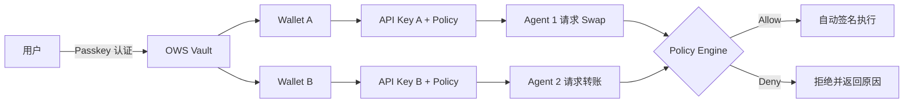

# Gradience Wallet

## Agent 钱包编排平台

以 Passkey 管理身份 · 以 OWS 管理本地多链钱包 · 以 Policy Engine 精确编排 Agent 权限

HashKey Chain Horizon Hackathon 2026

---
layout: default
---

# 一句话定义

Gradience Wallet 是一个面向个人与企业的 Agent 钱包编排平台 —— 以 Passkey 管理主身份、以 OWS 管理钱包、以智能策略引擎管理权限，支持 Agent 安全自主交易与支付。

  

    
🗝️ Passkey

    
无助记词现代身份认证

  

  

    
🔐 OWS

    
本地 first 多链钱包标准

  

  

    
🛡️ Policy

    
签名前自动评估与拦截

  

---
layout: default
---

# 核心机制：Agent 怎么用钱包？

<strong>关键：</strong>Agent 不持有私钥。每一步操作都必须先通过 Policy Engine 的 pre-signing 评估。

---
layout: default
---

# 竞争壁垒：Gradience vs Tempo

| 维度 | Tempo Wallet | Gradience Wallet |
|:---|:---|:---|
| **钱包标准** | Tempo 自有单生态 | **OWS 开放标准多链钱包**（BIP-39，本地 vault） |
| **Agent 权限** | 基础 spending limit | **多层 Policy Engine**：限额 + 合约/操作/时间/模型白名单 + 意图风险 + 动态信号 |
| **交互协议** | 私有协议 | **MCP (Model Context Protocol)** — 任何 LLM/Agent 标准接入 |
| **安全审计** | 基础日志 | **HMAC-chained audit log + Merkle tree 上链 anchoring** |
| **部署形态** | Tempo 托管 SaaS | **Local-first 单二进制** + 可选自托管云部署 |

<strong>核心差异：</strong>Tempo 是“给 Agent 一个钱包”；Gradience 是“让用户真正拥有自己的钱包，并精确编排 Agent 能做什么”。

---
layout: default
---

# 已落地的产品矩阵

🌐 Web Dashboard

钱包管理、余额、Swap、Fund、API Key、策略配置

STATUS: ONLINE

🔌 MCP Server

7 个标准 tool，schemars 自动生成 JSON Schema

STATUS: ONLINE

💻 CLI

Device auth 浏览器登录、本地/远程双模式

STATUS: ONLINE

🖼️ Embedded Wallet

/embed iframe + postMessage，第三方 dApp 可嵌入

STATUS: ONLINE

🎬 Examples & Playgrounds

4 个独立 demo + 一键启动脚本 (run-all.sh)

STATUS: ONLINE

🚀 Deployment Ready

Dockerfile + DEPLOY.md (Vercel + Railway/Fly.io)

STATUS: READY

---
layout: default
class: text-center
---

# Demo 流程

## 现场 5 分钟演示

  
1

  

    
注册 & 登录

    
Web 端 Passkey 注册 → 创建 Wallet → 查看 Balance & Swap

  

  
2

  

    
邮箱恢复 Passkey（跨设备）

    
Forgot Passkey → 输入 recovery code → 新设备重新注册 Passkey → 同一钱包恢复

  

  
3

  

    
CLI Device Auth

    
<code>gradience auth login</code> → 浏览器确认 → CLI 自动拿到 token → <code>gradience auth whoami</code>

  

  
4

  

    
MCP Client 演示

    
Node.js MCP 客户端 spawn gradience-mcp → tools/list → tools/call (get_balance)

  

  
5

  

    
嵌入式钱包

    
第三方 dApp demo 通过 iframe 请求签名 → 用户在 embed 页面 Approve/Reject

  

---
layout: default
class: text-center
---

# 谢谢

Autonomy with guardrails — that's the only way Agentic Economy scales.

GitHub: github.com/your-org/gradience-wallet 
Demo: localhost:3000 | CLI: gradience auth login

